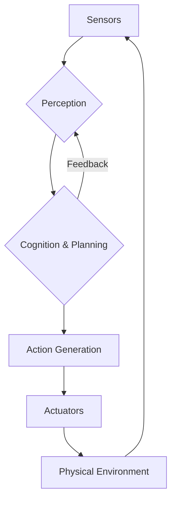

# Physical AI Foundations

This chapter introduces the core concepts of Physical AI and embodied intelligence, laying the groundwork for understanding how artificial intelligence can interact with and understand the physical world through robotic systems.

## Introduction to Physical AI
Physical AI represents a paradigm shift in artificial intelligence, moving beyond purely computational or abstract reasoning to systems that directly interact with and are embedded within physical environments. Unlike traditional AI, which often operates solely in digital domains, Physical AI emphasizes the inseparable link between intelligence, embodiment, and interaction with the real world.

### Definition and Scope
Physical AI (or Embodied AI) focuses on intelligent agents that possess a physical body, can perform actions in the physical world, and gather sensory data from their environment. Its scope encompasses areas such as robotics, human-robot interaction, autonomous systems, and pervasive computing. Key aspects include perception (interpreting sensory input), cognition (reasoning and decision-making), and action (physical manipulation and locomotion).

### Historical Context and Evolution
The roots of Physical AI can be traced back to early cybernetics and robotics, where researchers explored the interplay between control systems and physical mechanisms. Notable milestones include early robotic arms, autonomous mobile robots, and the development of intelligent control theories. The evolution of Physical AI has been significantly influenced by advancements in sensor technology, computational power, and materials science, enabling more sophisticated and agile physical agents (Brooks, 1991).

### Key Characteristics and Differences from Traditional AI
| Feature              | Traditional AI (e.g., Chess AI)            | Physical AI (e.g., Humanoid Robot)       |
|----------------------|----------------------------------------------|------------------------------------------|
| **Environment**      | Simulated, abstract, digital                 | Real-world, dynamic, physical            |
| **Interaction**      | Through symbolic input/output                | Through sensors and actuators            |
| **Learning**         | From datasets, patterns in data              | From physical experience, trial-and-error|
| **Embodiment**       | None                                         | Required (physical body)                 |
| **Core Problem**     | Logic, pattern recognition, prediction       | Control, manipulation, navigation, safety|

## Embodied Intelligence
Embodied intelligence posits that an agent's physical body, and its interactions with the environment, play a crucial role in shaping its cognitive capabilities. Intelligence is not just in the "brain" but emerges from the entire system, including its sensors, actuators, and morphology.

### What is Embodied Intelligence?
It suggests that intelligent behavior arises from the dynamic interaction between a physical body, its brain (control system), and its environment. The shape, size, and capabilities of a robot's body profoundly influence how it perceives the world, how it moves, and what problems it can solve. For example, a robot designed with wheels will "understand" navigation differently than one with legs (Pfeifer & Scheier, 1999).

### Importance in Robotics
In robotics, embodied intelligence is paramount for achieving robust and adaptable behaviors in unstructured environments. It emphasizes that:
*   **Perception is Action-Oriented**: What a robot perceives is often guided by its current task and physical capabilities.
*   **Control is Grounded**: Abstract commands must be translated into physical movements, taking into account dynamics, friction, and gravity.
*   **Learning is Experiential**: Robots learn by doing, experiencing the consequences of their actions in the physical world, which can be more effective than purely simulated learning for certain tasks.

### Examples in Nature and Artificial Systems
*   **Nature**: Animals demonstrate high levels of embodied intelligence. A bird's flight is a complex interplay of wing shape, feather mechanics, and neural control. A human's ability to grasp an object is influenced by hand anatomy and proprioception.
*   **Artificial Systems**:
    *   **Walking Robots**: Robots with legs (e.g., Boston Dynamics Spot, Unitree Go2) leverage their morphology to traverse rough terrains, adapting their gait based on ground feedback.
    *   **Manipulators**: Robotic arms with dexterous grippers use touch sensors and force feedback to delicately handle objects.
    *   **Soft Robots**: Robots made from compliant materials use their inherent flexibility to navigate confined spaces or safely interact with humans.

## AI Architectures for Physical Systems
The design of an AI architecture for physical systems must account for the unique challenges of real-world interaction, including real-time processing, uncertainty, and safety.

### Simplified Physical AI Architecture
Below is a simplified architectural diagram illustrating the key components and their interaction in a Physical AI system.

*Figure 1: Simplified Physical AI Architecture. Sensory input drives perception, which informs cognition and planning. Actions are generated and executed by actuators, affecting the physical environment, thus closing the loop.*

### Reactive vs. Deliberative Systems
*   **Reactive Systems**: Directly map sensory input to motor actions. They are fast and robust to dynamic environments but lack planning capabilities. (e.g., a robot avoiding an obstacle based on immediate sensor readings).
*   **Deliberative Systems**: Involve planning, reasoning, and world modeling before executing actions. They can solve complex problems but can be slow and brittle to unexpected changes. (e.g., a robot planning a long-distance route).
*   **Subsumption Architecture**: A classic hybrid approach where simpler, reactive behaviors "subsume" or override more complex, deliberative ones when necessary, allowing for robust behavior (Brooks, 1986).

### Hybrid Architectures
Modern Physical AI systems often employ hybrid architectures that combine the strengths of both reactive and deliberative approaches. This typically involves:
*   **Hierarchical Control**: High-level deliberative planning (e.g., mission planning, task decomposition) influencing low-level reactive control (e.g., joint actuation, obstacle avoidance).
*   **Cognitive Robotics**: Integrating symbolic AI (knowledge representation, logical reasoning) with subsymbolic AI (neural networks for perception and control).

### Role of Perception and Action
*   **Perception**: The process of extracting meaningful information from sensory data (e.g., cameras, lidar, force sensors). For physical systems, perception must often be real-time and robust to noise and varying conditions. It guides action.
*   **Action**: The physical movements and manipulations performed by the robot's actuators. Actions are constrained by the robot's kinematics, dynamics, and safety protocols. Actions also influence subsequent perceptions. The perception-action loop is fundamental.

## Challenges and Future Directions
Physical AI faces significant challenges but holds immense promise for the future of robotics.

### Real-world Complexities
*   **Uncertainty**: The real world is inherently noisy and unpredictable. Sensors can be unreliable, and models can be inaccurate.
*   **Safety**: Ensuring robots operate safely around humans and in fragile environments is paramount.
*   **Generalization**: Training robots to perform tasks in one environment and generalize that knowledge to new, unseen environments remains a major hurdle.
*   **Energy and Autonomy**: Designing robots that are energy-efficient and can operate autonomously for extended periods.

### Ethical Considerations
*   **Accountability**: Who is responsible when an autonomous robot causes harm?
*   **Bias**: AI models can inherit biases from their training data, leading to unfair or discriminatory behaviors in physical robots.
*   **Human-Robot Interaction**: Designing robots that are trustworthy, transparent, and respectful in their interactions with humans.

### Emerging Trends
*   **Large Language Models (LLMs) for Robotics**: Using LLMs for high-level planning, natural language command interpretation, and code generation for robot tasks.
*   **Foundation Models for Perception and Control**: Developing large-scale, pre-trained models that can generalize across various robotic platforms and tasks.
*   **Human-in-the-Loop Robotics**: Systems that allow human operators to intervene and guide autonomous robots when necessary, combining human intuition with robotic precision.
*   **Shared Autonomy**: Robots and humans collaboratively performing tasks, with dynamic allocation of control based on task demands and user preferences.

## References
Brooks, R. A. (1986). A robust layered control system for a mobile robot. *IEEE Journal of Robotics and Automation*, 2(1), 14-23.
Brooks, R. A. (1991). Intelligence without representation. *Artificial Intelligence*, 47(1-3), 139-159.
Pfeifer, R., & Scheier, C. (1999). *Understanding intelligence*. MIT Press.