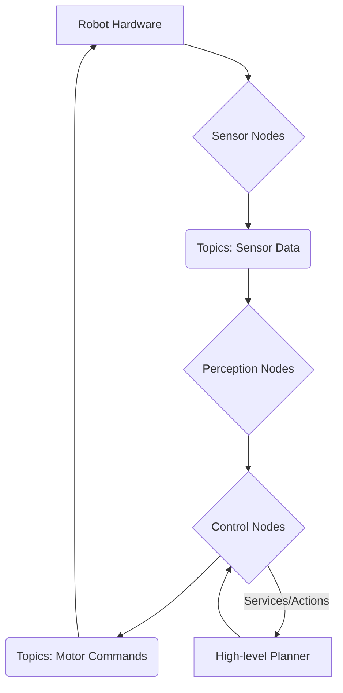

# ROS 2 Nervous System

This chapter covers the fundamentals of ROS 2 and its application as the "nervous system" for humanoid robots, orchestrating communication and control.

## Introduction to ROS 2
ROS 2 (Robot Operating System 2) is a flexible framework for writing robot software. It's a collection of tools, libraries, and conventions that aim to simplify the task of creating complex and robust robot behaviors across a wide variety of robotic platforms. For humanoid robots, ROS 2 provides the necessary infrastructure to manage diverse sensors, actuators, and intelligent control algorithms.

### Simplified ROS 2 Architecture
Below is a simplified architectural diagram illustrating the key components and their interaction in a ROS 2 system.

*Figure 1: Simplified ROS 2 Architecture for Humanoid Control. Sensor data flows through topics to perception and control nodes, which send motor commands back to hardware. High-level planners interact via services and actions.*

### ROS 2 Architecture and Concepts
At its core, ROS 2 is built around a distributed publish/subscribe messaging system, enabling modular and decoupled components. Key concepts include:
*   **Nodes**: Executable processes that perform computation (e.g., a sensor driver, a motor controller, a path planner).
*   **Topics**: Named buses over which nodes exchange messages. Messages are data structures containing information (e.g., sensor readings, velocity commands).
*   **Services**: Request/reply communication mechanisms for synchronous, blocking operations (e.g., asking a robot to perform a specific action and waiting for completion).
*   **Actions**: Long-running, asynchronous tasks that provide continuous feedback and allow for preemption (e.g., a robot navigating to a goal, providing progress updates).
*   **Parameters**: Dynamic configuration values for nodes.

### Advantages over ROS 1
ROS 2 was re-architected to address limitations of ROS 1, offering significant improvements for modern robotics:
*   **Real-time Performance**: Built on DDS (Data Distribution Service) for better real-time and deterministic communication.
*   **Multi-robot Support**: Designed for multi-robot systems and distributed deployments.
*   **Security**: Enhanced security features for communication, authentication, and access control.
*   **Quality of Service (QoS)**: Configurable reliability, durability, and latency settings for topics.
*   **Supported Platforms**: Broader support for various operating systems beyond Linux, including Windows and macOS.

### Installation and Basic Setup (Ubuntu 22.04)
This section will guide through installing ROS 2 on Ubuntu 22.04 (e.g., Humble Hawksbill or Iron Irwini distribution) and setting up a basic workspace.
*   System requirements and prerequisites.
*   Source-based vs. binary installation methods.
*   Creating and building a ROS 2 workspace (`colcon build`).
*   Running basic ROS 2 examples (e.g., `talker` and `listener`).

## ROS 2 for Humanoid Control
Humanoid robots present unique control challenges due to their high degrees of freedom, dynamic balance requirements, and complex interaction with the environment. ROS 2 provides powerful tools to manage these complexities.

### Publishers and Subscribers for Sensor Data and Motor Commands
*   **Sensor Data**: Nodes publish sensor data (e.g., joint encoders, IMU, camera feeds) on dedicated topics. Control algorithms subscribe to these topics to get real-time state information.
*   **Motor Commands**: Control nodes publish commands (e.g., joint positions, velocities, torques) to topics that motor controller nodes subscribe to, driving the robot's actuators.
*   **Message Types**: Utilizing standard ROS 2 message types (e.g., `sensor_msgs`, `geometry_msgs`, `control_msgs`) and custom message definitions for specific humanoid functionalities.

### Service-based Communication for Complex Tasks
Services are suitable for one-shot, blocking operations where a node requests a task and waits for a response. Examples in humanoid control include:
*   **Configuration Changes**: Setting gait parameters or controller gains.
*   **Mode Switching**: Changing between walking, standing, or manipulation modes.
*   **High-level Queries**: Requesting the robot's current pose or status.

### Action-based Feedback for Long-running Operations
Actions are ideal for tasks that take time to complete and require continuous feedback, preemption capabilities, and a clear goal.
*   **Locomotion**: Commanding the robot to walk to a specific location, receiving feedback on its progress, and potentially cancelling the action mid-way.
*   **Complex Manipulations**: Instructing the robot to pick up an object, with feedback on gripper force, object detection, and joint trajectories.
*   **Whole-body Control**: Orchestrating coordinated movements of the entire humanoid body to maintain balance or perform dynamic tasks.

## ROS 2 Packages for Humanoids
The ROS 2 ecosystem offers various packages that are directly relevant or adaptable for humanoid robot development.

### Overview of Relevant Packages
*   **`ros2_control`**: A framework for robot hardware abstraction, enabling consistent control interfaces across different robot platforms. Essential for managing humanoid joint controllers.
*   **`moveit_ros`**: A powerful framework for motion planning, manipulation, and inverse kinematics, crucial for humanoid arm and leg movements.
*   **`navigation2`**: For autonomous navigation tasks, adaptable for humanoid path planning in complex environments.
*   **`perception_pcl`**: Point Cloud Library integration for 3D perception from depth sensors.

### Custom Package Creation
Guidance on creating custom ROS 2 packages for humanoid-specific functionalities:
*   Defining custom message, service, and action types.
*   Implementing nodes for specialized control or perception tasks.
*   Structuring a ROS 2 package for maintainability and reusability.

### Best Practices for ROS 2 Development
*   **Modular Design**: Decompose complex behaviors into small, testable nodes.
*   **Asynchronous Programming**: Leverage ROS 2's asynchronous clients and executors for efficient resource utilization.
*   **Error Handling**: Implement robust error detection and recovery mechanisms.
*   **Logging and Debugging**: Utilize ROS 2 logging tools and RQT for introspection.

## Interfacing with Hardware
Bringing a ROS 2 control system to a physical humanoid robot involves interfacing with its low-level hardware.

### Drivers and Interfaces for Motors, Sensors
*   **Motor Drivers**: Custom or off-the-shelf drivers to communicate with robot joint motors (e.g., via CAN bus, EtherCAT).
*   **Sensor Interfaces**: Reading data from IMUs, force-torque sensors, cameras, and other onboard sensors.
*   **`ros2_control` Hardware Interfaces**: Developing custom hardware interfaces within `ros2_control` to integrate specific robot hardware.

### Real-time Considerations
*   **Real-time Operating Systems (RTOS)**: Discussion on the importance of real-time performance for stable humanoid control and how RTOS like Xenomai or PREEMPT_RT kernel patches can be used with ROS 2.
*   **Control Loop Frequencies**: Managing the timing and synchronization of various control loops to ensure stability and responsiveness.

### Troubleshooting Common ROS 2 Issues
*   Network configuration (`RMW_IMPLEMENTATION`, `ROS_DOMAIN_ID`).
*   Dependency resolution.
*   Launch file debugging.
*   Performance bottlenecks.

## References
Macenski, S., et al. (2020). *Robot Operating System 2: Design, Architecture, and Development Process*. arXiv preprint arXiv:2006.01416.
Foote, T. (2020). ROS 2 and its ecosystem. *Robotics and Autonomous Systems*, 133, 103622.
Chitta, S., et al. (2020). `ros2_control`: A Universal Robot Control Framework. *Proceedings of the International Conference on Robotics and Automation (ICRA)*.
